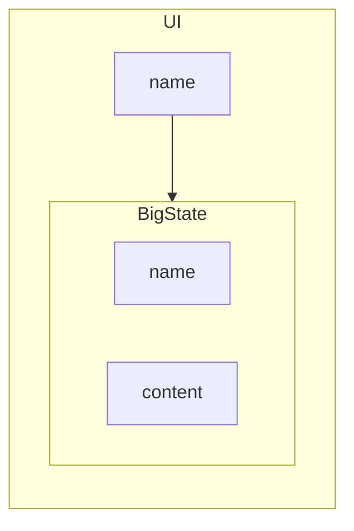

## 状态管理
Vue 对块状态进行响应式监听来影响 UI 变化，然后对块状态的所有属性都进行深层监听。监听者注册 effect 后，当块状态变化时，监听者会被影响。这种管理方式经常带来一些问题。例如，我们很容易就写出了这样的代码：
```vue
<script setup lang="ts"> 
const a = reactive({
  b: xxx,
  c: {
    d: xxx
  }
})
</script>

<template>
<!-- ... -->
{{ a.c.d }}
</template>
```

当我们让 `a.c = { d: new_calue }` 的时候，问题就出现了。在模板里，看起来 `a.c.d` 是引用和跟踪了 `() => a.c.d`，但实际上 `a.c.d` 只是引用和跟踪了第一次赋值时的 `a.c.d`。

许多新手通常在搞明白 Vue 的响应式原理和 JS 的引用机制之前，就会被这种问题搞的晕头转向。

这真是一直反直觉的设计。


